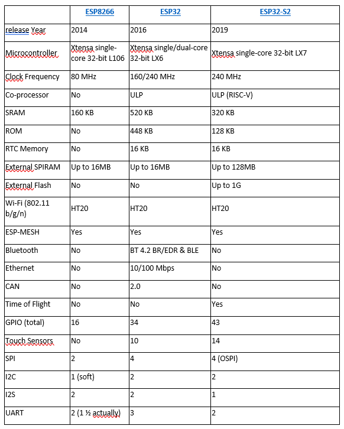

# SPIFFS (sous VC Code)

**Pour VS Code (même principe) :**

[**https://microcontrollerslab.com/upload-files-esp32-spiffs-vs-code-platformio-ide/**](https://microcontrollerslab.com/upload-files-esp32-spiffs-vs-code-platformio-ide/)

Avec PlatformIO, créez un nouveau projet, appelé par exemple ESP32\_SPIFFS, avec la carte ESP32 NodeMCU et le framework Arduino.

Créer un répertoire data. Dedans, mettre (ou créer) un fichier test.txt avec votre texte.

<figure><figcaption></figcaption></figure>

Le ficher main.cpp de votre projet contient le même fichier que précédemment sous Arduino en incluant la bibliothèque Arduino.h :

<figure><figcaption></figcaption></figure>

Ensuite, cliquez sur l’icône PlatformIO (la fourmi), puis dans Project tasks :

\-        sur Built Filesystem Image

\-        sur Upload Filesystem Image (n’oubliez pas de connecter votre ESP32 à un port USB)

<figure><figcaption>
Puis téléverser (upload) le programme main.cpp dans l’ESP32.
</figcaption></figure>

Puis téléverser (upload) le programme main.cpp dans l’ESP32.

La sortie du moniteur série est la suivante :

<figure><figcaption></figcaption></figure>
