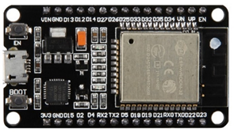

# Exercice surveillance de l'ESP32

**Exercice : Surveillance**

Utiliser un second ESP32 pour surveiller le bon fonctionnement du premier en instaurant une sorte de redondance. Par exemple, surveiller si le premier ESP32 est toujours alimenté, son nombre de reset pouvant indiquer un dysfonctionnement, etc.

Débranchez le câble d’alimentation du premier ESP32, le second doit afficher des messages d’alerte sur le moniteur série.

**Faire le montage et écrire le code correspondant en s’inspirant des exemples précédents.**

L’ESP32 à droite surveille l’ESP32 qui est à gauche de la figure.

A gauche, un bouton-poussoir est connecté entre la masse et la broche GPIO 18 (mettre cette broche en mode PULL-UP). Quand on appuie dessus pendant plus de 3 secondes, le WatchDog Timer se déclenche et fait un Software Reset (SW) pour redémarrer l’ESP32. Une diode est montée en série avec une résistance de 330 ohms à la sortie de la broche GPIO 4. Cette broche sera à l’état haut en sortie lors d’un Software Reset. La LED s’allumera alors brièvement pour le vérifier.

A droite, l’ESP32 « surveillant » a 2 broches en entrée reliée à l’ESP32 de gauche

\-        La broche GPIO 13 reliée au GPIO 4 pour compter les SW Reset

\-        La broche GPIO 14 reliée à l’alimentation +3,3 V pour un défaut d’alimentation

Ce défaut d’alimentation sera créé en débranchant le ports USB de l’ESP32 de gauche. Le comptage se fait pour chaque action : débrancher et rebrancher comptera pour 2.

<figure><figcaption></figcaption></figure>

<figure><figcaption></figcaption></figure>

**Amélioration de la surveillance :**

Cependant, c’est dommage que l’ESP32 surveillant fonctionne en permanence, et consomme de l’énergie, alors qu’il existe des modes Sleep.

Mettez l’ESP32 « surveillant » en mode Deep Sleep et faire en sorte qu’il se réveille uniquement par un évènement extérieur pour compter les SW Reset du premier ESP32.

**Au préalable**, testez le réveil externe pour sortir l’ESP32 du mode Deep Sleep (**Wake-up External source**). Faire le montage associé avec 2 résistances de 10 kOhms, testez le programme qui est à la fin du tutoriel suivant (partie Réveil externe) et ajouter un compteur :



Pour GPIO34 et GPIO 35, le masque à utiliser est (en hexa) : 0xC00000000.

<figure><figcaption></figcaption></figure>

**Travail à réaliser :**

Adapter le programme du tutoriel pour qu’il fonctionne avec les deux ESP32 afin de minimiser la consommation d’énergie.

Nous sommes en **mode Pull-down** (schéma de droite), quand on appuie sur un bouton poussoir, un niveau HIGH est détecté par GPIO34 ou GPIO35, ce qui réveille l’ESP32.

<figure><figcaption></figcaption></figure>

Référence :


